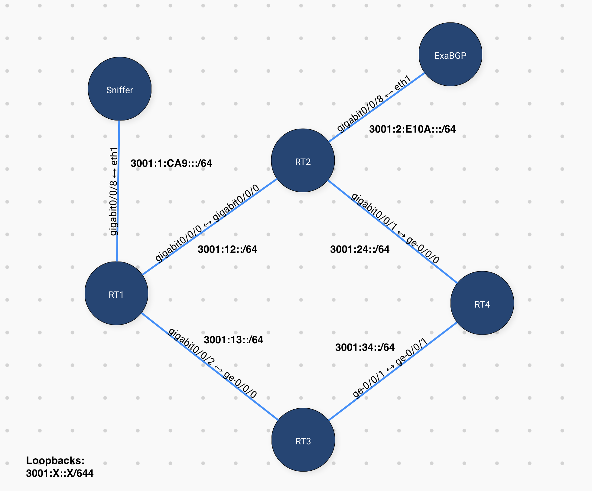

# nanog77-hackathon-demo
 Demo of Traffic Exceptions for Nanog77 Hackathon

# The Lab Network
There are 4 routers and 2 Ubuntu hosts. The network has:
- IGP: OSPF & OSPFv3
- BGP: IPv6 Sessions carrying IPv4/IPv6 advertisements
- BGP Peering with the ExaBGP peer for receiving injected NLRI

# Setting up the Demo
We'll need the following components setup to get the Demo up and running. There are guides to setup each component along with steps for verification along the way. Follow these guides in the order specified:
1. Network setup ([Router configs](./configs))
1. ExaBGP ([Host setup](./exabgp))

# Setting up the test hosts

Host1:

    # Install Traceroute
    sudo apt-get install traceroute
    # Setup networking
    sudo ip addr add 3001:1:a::10/64 dev eth1
    sudo ip -6 route add default via 3001:1:a::1
    # Test networking
    ping -c 3 3001:2:e10a::2

Host2:

    sudo ip addr add 3001:4:b::10/64 dev eth1
    sudo ip -6 route add default via 3001:4:b::1
    # Test networking
    ping -c 3 3001:1:a::10

# Testing traffic influence

Host1:
    
    $ traceroute -s 3001:1:a::10 3001:4:b::10
    traceroute to 3001:4:b::10 (3001:4:b::10), 30 hops max, 80 byte packets
     1  3001:1:a::1 (3001:1:a::1)  6.959 ms  6.915 ms  6.888 ms
     2  3001:13::3 (3001:13::3)  14.177 ms  14.120 ms  14.123 ms
     3  3001:34::4 (3001:34::4)  14.091 ms  14.062 ms  14.044 ms
     4  3001:4:b::10 (3001:4:b::10)  22.202 ms  22.186 ms  22.169 ms

Router1:

    router1> show route table inet6flow.0
    inet6flow.0: 1 destinations, 1 routes (0 active, 0 holddown, 1 hidden)

Router4:

    router4#show bgp ipv6 flow
    router4#

Host1, simulate a FlowSpec announcement:

    curl --form "command=announce flow route source 3001:1:a::10/128 destination 3001:4:b::10/128 redirect 6:302" \
        http://[3001:2:e10a::10]:5000/command

Router1:

    router1> show route table inet6flow.0

    inet6flow.0: 1 destinations, 1 routes (1 active, 0 holddown, 0 hidden)
    + = Active Route, - = Last Active, * = Both

    3001:1:a::10/128,3001:4:b::10/128/term:1
                    *[BGP/170] 00:38:34, localpref 65000
                        AS path: 65010 I, validation-state: unverified
                        >  to 3001:2::2
    router1> show firewall filter __flowspec_default_inet6__

    Filter: __flowspec_default_inet6__
    Counters:
    Name                                                Bytes              Packets
    3001:4:b::10/128,3001:1:a::10/128                    1760                   22

Router4:
   
   router4#show bgp ipv6 flow | b Network
        Network          Next Hop            Metric LocPrf Weight Path
    * i  Dest:3001:4:B::10/0-128,Source:3001:1:A::10/0-128
                        3001:2::2

And Viola!!!

    $ traceroute -s 3001:1:a::10 3001:4:b::10
    traceroute to 3001:4:b::10 (3001:4:b::10), 30 hops max, 80 byte packets
     1  3001:1:a::1 (3001:1:a::1)  2.321 ms  2.241 ms  2.208 ms
     2  3001:12::2 (3001:12::2)  9.576 ms  9.544 ms  9.499 ms
     3  3001:24::4 (3001:24::4)  21.666 ms  21.637 ms  21.618 ms
     4  * 3001:4:b::10 (3001:4:b::10)  21.559 ms  21.502 ms

You can remove the Flowspec route with:

    curl --form "command=withdraw flow route source 3001:1:a::10/128 destination 3001:4:b::10/128 redirect 6:302" \
         http://[3001:2:e10a::10]:5000/command

# References
A big thanks to all the tools and articles that helped make this demo possible:
- [ExaBGP](https://github.com/Exa-Networks/exabgp)
- Tesuto
- ["BGP Flowspec redirect with ExaBGP" by Tim Gregory](https://tgregory.org/2018/01/31/bgp-flowspec-redirect-with-exabgp/)
- ["Using BGP Flowspec (DDoS Mitigation)"](https://archive.nanog.org/sites/default/files/tuesday_general_ddos_ryburn_63.16.pdf)
- ["BGP Flowspec Tutorial" - Mark Brochu](https://meetings.internet2.edu/media/medialibrary/2018/10/19/20181015-brochu-BGP-Flowspec.pdf)
- ["Leveraging BGP FlowSpec to Protect Your Infrastructure" - Nicolas Fevrier](https://www.ciscolive.com/c/dam/r/ciscolive/emea/docs/2019/pdf/BRKSPG-3012.pdf)
- ["Controlling ExaBGP: Interacting from the API"](https://github.com/Exa-Networks/exabgp/wiki/Controlling-ExaBGP-:-interacting-from-the-API)

And some of my own articles that came in handy:
- [Influence Routing Decisions with Python and ExaBGP](https://thepacketgeek.com/influence-routing-decisions-with-python-and-exabgp/)
- Scapy: Per-packet actions [part 1](https://thepacketgeek.com/scapy-sniffing-with-custom-actions-part-1/), [part 2](https://thepacketgeek.com/scapy-sniffing-with-custom-actions-part-2/)
- [Give ExaBGP an HTTP API](https://thepacketgeek.com/give-exabgp-an-http-api-with-flask/)