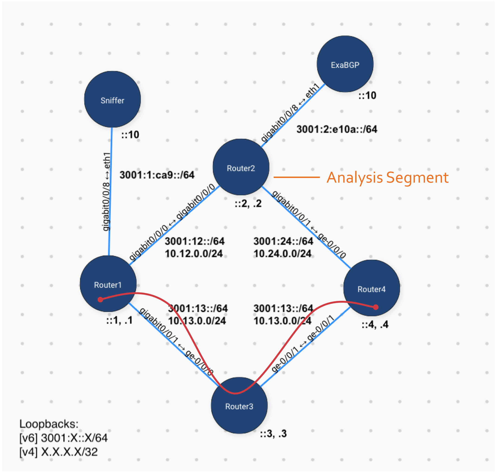

# nanog77-hackathon-demo
 Demo of Traffic Exceptions for Nanog77 Hackathon

# The Lab Network
The network has:
- 4 Routers
  - OSPFv3, BGP peerings over IPv6 (carrying IPv6 Unicast & FlowSpec)
- 1 ExaBGP Host
  - Peering with Router2 to inject FlowSpec NLRI
- 1 Sniffer Host
  - Used to trigger on TCP Retransmit traffic
- 2 Test Hosts
  - This demo is trying to influence traffic between these hosts

# The Scenario
- Router2 is in a Traffic Analysis segment of the network where we might have special traffic monitoring happening for troubleshooting.
- When problematic flows (high TCP Retransmits) occur, we want to divert that traffic from the normal, steady-state path to our special Traffic Analysis segment.
- Router2 has **high OSPF interface costs so it will not typically be a transit hop**. Flows between Host1 and Host2 will typically transit through Router3:

- When the high TCP Retransmit flows are detected (via our [Sniffer](sniffer/) and the [`detect.py`](sniffer/detect.py) script), an API call is made to the ExaBGP host.
- ExaBGP will then announce a FlowSpec flow route into the eBGP peering session with Router2.
- Router2 advertises the FlowSpec NLRI to the rest of the network with a next-hop of itself, in order to draw the interesting traffic towards it.
- Router1 and Router4 have config to install the FlowSpec routes and redirect traffic to the next-hop (in this case, Router2).

# Setting up the Demo
We'll need the following components setup to get the Demo up and running. There are guides to setup each component along with steps for verification along the way. Follow these guides in the order specified:
1. Network setup ([Router configs](./configs))
1. ExaBGP ([Host setup](./exabgp))

# Setting up the test hosts
We need to get our test hosts ready to communicate using the network we've just built

Host1:

    # Install Traceroute
    sudo apt-get install traceroute
    # Setup networking
    sudo ip addr add 3001:1:a::10/64 dev eth1
    sudo ip addr add 3001:1:a::20/64 dev eth1
    sudo ip -6 route add default via 3001:1:a::1
    # Test networking
    ping -c 3 3001:4:b::4
    ping -c 3 3001:2:e10a::2

Host2:

    sudo ip addr add 3001:4:b::10/64 dev eth1
    sudo ip -6 route add default via 3001:4:b::1
    # Test networking
    ping -c 3 3001:1:a::10

# Testing traffic influence
Ok, now let's see what FlowSpec can do for us.

## Steady State
We can see there are currently no FlowSpec rules on Router1:

    router1> show route table inet6flow.0
    router1>

Nor Router4:

    router4#show bgp ipv6 flow
    router4#

Due to the high OSPF cost of Router2's interfaces, it will not be used for transit between Router1 and Router4. Notice the traceroute shows this flow transiting Router3:

    host1$ traceroute -s 3001:1:a::10 3001:4:b::10
    traceroute to 3001:4:b::10 (3001:4:b::10), 30 hops max, 80 byte packets
     1  3001:1:a::1 (3001:1:a::1)  6.959 ms  6.915 ms  6.888 ms
     2  3001:13::3 (3001:13::3)  14.177 ms  14.120 ms  14.123 ms
     3  3001:34::4 (3001:34::4)  14.091 ms  14.062 ms  14.044 ms
     4  3001:4:b::10 (3001:4:b::10)  22.202 ms  22.186 ms  22.169 ms
    
    $ traceroute -s 3001:1:a::20 3001:4:b::10
    traceroute to 3001:4:b::10 (3001:4:b::10), 30 hops max, 80 byte packets
     1  3001:1:a::1 (3001:1:a::1)  7.885 ms  7.730 ms  7.756 ms
     2  3001:13::3 (3001:13::3)  23.147 ms  23.121 ms  23.099 ms
     3  3001:34::4 (3001:34::4)  23.053 ms  22.991 ms  23.010 ms
     4  3001:4:b::10 (3001:4:b::10)  22.994 ms  22.963 ms  22.946 ms

## Traffic Exception, FlowSpec rule injected
From Host1, we'll simulate a FlowSpec announcement (that would typically be coming from Sniffer):

    curl --form "command=announce flow route source 3001:1:a::10/128 destination 3001:4:b::10/128 redirect 6:302" \
        http://[3001:2:e10a::10]:5000/command

And we can see the FlowSpec rule on Router1:

    router1> show route table inet6flow.0

    inet6flow.0: 1 destinations, 1 routes (1 active, 0 holddown, 0 hidden)
    + = Active Route, - = Last Active, * = Both

    3001:1:a::10/128,3001:4:b::10/128/term:1
                    *[BGP/170] 00:38:34, localpref 65000
                        AS path: 65010 I, validation-state: unverified
                        >  to 3001:2::2
    router1> show firewall filter __flowspec_default_inet6__

    Filter: __flowspec_default_inet6__
    Counters:
    Name                                                Bytes              Packets
    3001:4:b::10/128,3001:1:a::10/128                    1760                   22

And Router4:
   
   router4#show bgp ipv6 flow | b Network
        Network          Next Hop            Metric LocPrf Weight Path
    * i  Dest:3001:4:B::10/0-128,Source:3001:1:A::10/0-128
                        3001:2::2

Viola!!! See that the traffic from ::10 is now being diverted through Router2  (and our ::20 traffic continues transiting through Router3) :D

    $ traceroute -s 3001:1:a::10 3001:4:b::10
    traceroute to 3001:4:b::10 (3001:4:b::10), 30 hops max, 80 byte packets
     1  3001:1:a::1 (3001:1:a::1)  2.321 ms  2.241 ms  2.208 ms
     2  3001:12::2 (3001:12::2)  9.576 ms  9.544 ms  9.499 ms
     3  3001:24::4 (3001:24::4)  21.666 ms  21.637 ms  21.618 ms
     4  * 3001:4:b::10 (3001:4:b::10)  21.559 ms  21.502 ms

    $ traceroute -s 3001:1:a::20 3001:4:b::10
    traceroute to 3001:4:b::10 (3001:4:b::10), 30 hops max, 80 byte packets
     1  3001:1:a::1 (3001:1:a::1)  7.527 ms  7.399 ms  7.399 ms
     2  3001:13::3 (3001:13::3)  14.992 ms  14.953 ms  14.955 ms
     3  3001:34::4 (3001:34::4)  30.839 ms  30.804 ms  30.805 ms
     4  3001:4:b::10 (3001:4:b::10)  22.710 ms  22.618 ms  22.583 ms

Note that the FlowSpec route is unidirectional, so return traffic from Host2 will still transit through Router2. Since we most likely want the bidirectional flow to transit Router2 for analysis, we'd want our traffic trigger to advertise both directions of the flow to ExaBGP. E.g.:

    curl --form "command=announce flow route source 3001:4:b::10/128 destination 3001:1:a::10/128 redirect 6:302" \
        http://[3001:2:e10a::10]:5000/command

You can remove the Flowspec route with:

    curl --form "command=withdraw flow route source 3001:1:a::10/128 destination 3001:4:b::10/128 redirect 6:302" \
         http://[3001:2:e10a::10]:5000/command

# Finally, Automatic Detection
Now that all of the infrastructure support is there, we can add in the detection part of the demo using Python and Scapy!

- First, setup the [Sniffer host](./sniffer):

## Running the script
The `detect.py` script can be run to sniff packets on the wire:

    $ ./detect.py
    Detecting retransmits from wire...

It will analyze sniffed TCP flows for retransmits and send messages them to the ExaBGP host specified in the Python file.

If you want to trigger from captured packets instead, just pass in a filepath of a `pcap` file:

    $ ./detect.py host_retransmit.pcap
    INFO:root:Detecting retransmits from host_retransmit.pcap...
    reading from file host_retransmit.pcap, link-type EN10MB (Ethernet)
    DEBUG:root:Sending command to ExaBGP: announce flow route source 3001:4:b::10/128 destination 3001:1:a::10/128 redirect 6:302
    DEBUG:root:Sending command to ExaBGP: announce flow route source 3001:1:a::10/128 destination 3001:4:b::10/128 redirect 6:302
    Flow 3001:4:b::10:443 <--> 3001:1:a::10:58719 has 5 retransmits!
    Flow 3001:4:b::10:443 <--> 3001:1:a::10:58719 has 5 retransmits!
    Flow 3001:4:b::10:443 <--> 3001:1:a::10:58719 has 5 retransmits!
    Flow 3001:4:b::10:443 <--> 3001:1:a::10:58719 has 5 retransmits!
    Flow 3001:4:b::10:443 <--> 3001:1:a::10:58719 has 5 retransmits!
    DEBUG:root:Flow ended: 3001:4:b::10:443 <--> 3001:1:a::10:58719
    DEBUG:root:Flow ended: 3001:1:a::10:58719 <--> 3001:4:b::10:443
    DEBUG:root:Flow ended: 3001:1:a::10:58719 <--> 3001:4:b::10:443
    

## Verifying the ExaBGP Influence
Running the `detect.py` script against the included host_retransmit.pcap file, we can see that the command was sent to ExaBGP and we now see a new FlowSpec route for the `3001:1:a::10:58719 <--> 3001:4:b::10:443` flow

On Router2:

    router2> show route protocol bgp table inet6flow.0

    inet6flow.0: 2 destinations, 2 routes (2 active, 0 holddown, 0 hidden)
    + = Active Route, - = Last Active, * = Both

    3001:1:a::10/128,3001:4:b::10/128/term:1
                    *[BGP/170] 00:06:12, localpref 65000, from 3001:2:e10a::10
                        AS path: 65010 I, validation-state: unverified
                        Receive
    3001:4:b::10/128,3001:1:a::10/128/term:2
                    *[BGP/170] 00:06:12, localpref 65000, from 3001:2:e10a::10
                        AS path: 65010 I, validation-state: unverified
                        Receive

And Router1:
    
    router1> show route table inet6flow.0

    inet6flow.0: 2 destinations, 2 routes (2 active, 0 holddown, 0 hidden)
    + = Active Route, - = Last Active, * = Both

    3001:1:a::10/128,3001:4:b::10/128/term:1
                    *[BGP/170] 00:07:28, localpref 65000
                        AS path: 65010 I, validation-state: unverified
                        >  to 3001:2::2
    3001:4:b::10/128,3001:1:a::10/128/term:2
                    *[BGP/170] 00:07:28, localpref 65000
                        AS path: 65010 I, validation-state: unverified
                        >  to 3001:2::2
    
To verify that the flow's packets are being affected, check the internal FlowSpec firewall:

    router1> show firewall filter __flowspec_default_inet6__

    Filter: __flowspec_default_inet6__
    Counters:
    Name                                                Bytes              Packets
    3001:1:a::10/128,3001:4:b::10/128                   15872                  124
    3001:4:b::10/128,3001:1:a::10/128                    2000                   25

# References
A big thanks to all the tools and articles that helped make this demo possible:
- ["BGP Flowspec redirect with ExaBGP" by Tim Gregory](https://tgregory.org/2018/01/31/bgp-flowspec-redirect-with-exabgp/)
- ["Using BGP Flowspec (DDoS Mitigation)"](https://archive.nanog.org/sites/default/files/tuesday_general_ddos_ryburn_63.16.pdf) [[video](https://www.youtube.com/watch?v=ttDUoDf6xzM&t=1935s)]
- [ExaBGP](https://github.com/Exa-Networks/exabgp): [Interacting from the API](https://github.com/Exa-Networks/exabgp/wiki/Controlling-ExaBGP-:-interacting-from-the-API)
- [Scapy](https://scapy.net/)
- [Tesuto](https://www.tesuto.com/) - Network Emulation

And some of my own articles that came in handy:
- [Influence Routing Decisions with Python and ExaBGP](https://thepacketgeek.com/influence-routing-decisions-with-python-and-exabgp/)
- Scapy: Per-packet actions [part 1](https://thepacketgeek.com/scapy-sniffing-with-custom-actions-part-1/), [part 2](https://thepacketgeek.com/scapy-sniffing-with-custom-actions-part-2/)
- [Give ExaBGP an HTTP API](https://thepacketgeek.com/give-exabgp-an-http-api-with-flask/)