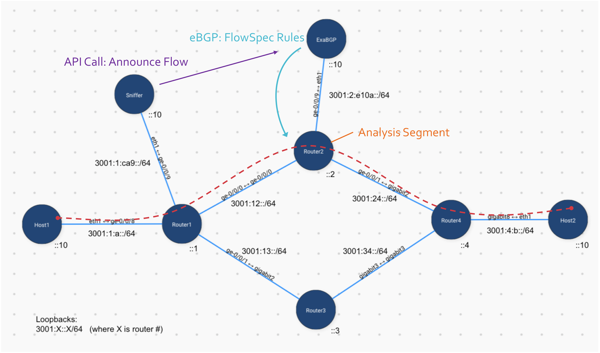
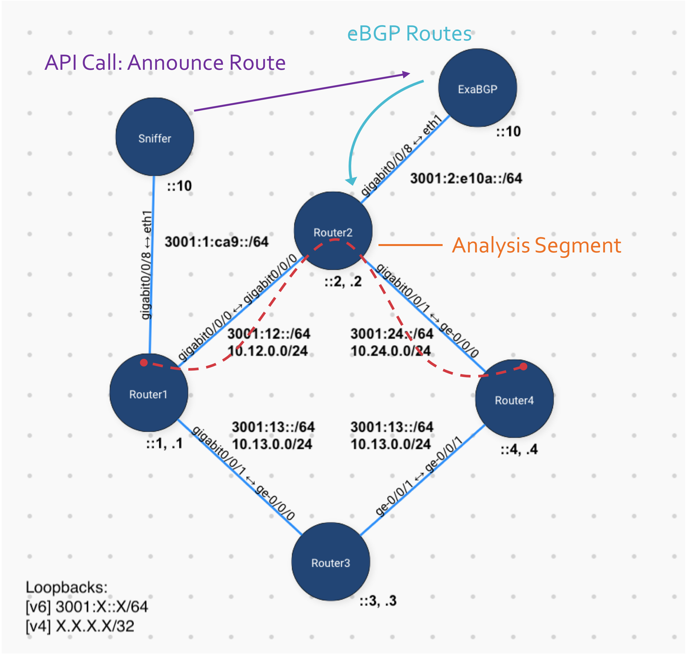

# nanog77-hackathon-demo
 The Nanog77 Hackathon theme is **Traffic Exceptions** and this repo contains demos that show how we can manage traffic exceptions using these 3 components:

### Exception Triggering
In order to manage our out-of-the-ordinary flows, we need a way to trigger and flag the flows that are interesting

### Network Config
The network should have a way of responding to exceptions and apply policies to get our traffic to the desired network segments

### Traffic Influencer
The piece that ties the previous two components together, this is how we inject policy into the network from an exception flow we've flagged.

# [FlowSpec for Granular Traffic Redirection/Monitoring](https://github.com/thepacketgeek/nanog77-hackathon-demo/tree/flowspec)

In this demo, we look at how to have more granular influence, at the TCP session level.

Instructions and files can be found [in this branch](https://github.com/thepacketgeek/nanog77-hackathon-demo/tree/flowspec)

# [Basic BGP Demo](https://github.com/thepacketgeek/nanog77-hackathon-demo/tree/basic-bgp)

Build a foundation and get ExaBGP talking to our network

Instructions and files can be found [in this branch](https://github.com/thepacketgeek/nanog77-hackathon-demo/tree/basic-bgp)

