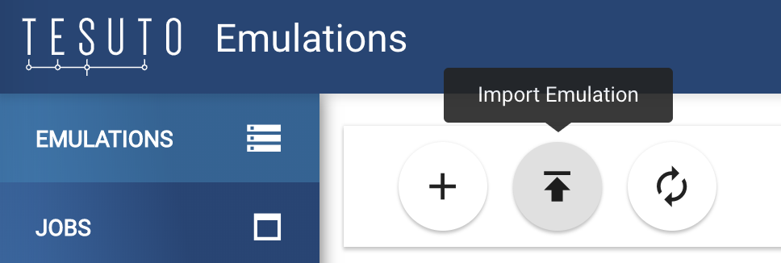

# Setting up the Network

In order to get the ExaBGP host up and running, we'll need:
- Tesuto Devices Added
- Connections between topology devices
- Router configs applied

## Import Tesuto Config
I have attached a [Tesuto topology export](nanog77-hackathon-demo.export) that you can import once logged into Tesuto

## Apply Router Configs

There are configs for all 4 routers included, you should be able to copy/paste them onto the devices once you're connected via the Tesuto console or SSH:

- Router1, IOS-XR ([config](router1.iosxr.cfg))
- Router2, IOS-XR ([config](router2.iosxr.cfg))
- Router3, JUNOS ([config](router3.junos.cfg))
- Router4, JUNOS ([config](router4.junos.cfg))

